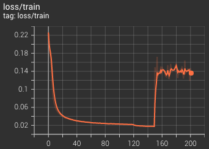
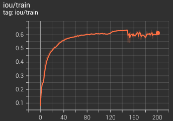
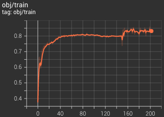

# Computer Vision Takehome - Decloaking Spaceship V2

### Deliverables:
  * _Final Score_: **0.82 AP @ IOU > 0.7**
  * _Model Architecture_: [file summary](https://github.com/adham-elarabawy/scale-ai-challenge/blob/main/architecture.txt)
  * _Training Script_: [train.py](https://github.com/adham-elarabawy/scale-ai-challenge/blob/main/train.py)
  * _Evaluation Script_: [main.py](https://github.com/adham-elarabawy/scale-ai-challenge/blob/main/main.py)
  * _Final Model Weights_: 
  * Installation Instructions: Below

####Installation Instructions:
Run the following command with a **python3** installation:

    pip3 install -r requirements.txt

####Some Notes:
This was a super fun project! As you're reading through my code, you'll find that I have this metric called _objectness_. This is simply my encoding of the model's confidence that an object exists there. You can think of it as a confidence score about the existence of a spaceship in the input image.

A quick summary of my implementation is below:

I implemented a generic (fully convolutional) CNN feature extractor as the body of the model. I then added a fully-connected head to perform bounding box regression (x, y, w, h, yaw) as well as classify whether or not a given input had a spaceship. It worked great with **0.82 AP @ IOU>0.7**. However, when I trained a model specifically for JUST localization, I got slightly better performance (since the model didn't have to perform a classification task). If I were to take this project a bit further, I would likely implement a multi-headed model with different sets of fully-connected layers for classification vs regression, but I'd keep the feature extractor frozen (after training for the localization task). Given that my initial approach had pretty good performance, I didn't feel the need to implement this modification, but I thought I'd note it regardless :)

#### Plots!
I absolutely love using _Tensorboard_ to keep track of my model training and evaluation metrics. I thought I'd throw up a couple of the generated plots on the README!

_**Loss vs Epoch**_

_**IOU vs Epoch**_

_**Objectness vs Epoch**_

-----------------------------------------------------------

**Problem:**
The goal is to detect spaceships which have been fitted with a cloaking device that makes them less visible. You are expected to use a deep learning model to complete this task. The model will take a single channel image as input and detects the spaceship (if it exists). Not all image will contain a spaceship, but they will contain no more than 1. For any spaceship, the model should predict their bounding box and heading. This can be described using five parameters:

* X and Y position (centre of the bounding box)
* Yaw (direction of heading)
* Width (size tangential to the direction of yaw)
* Height (size along the direct of yaw)

We have supplied a base model as a reference which performs poorly and has some serious limitations. You can extend the existing model or reimplement from scratch in any framework of your choice.

The metric for the model is AP at an IOU threshold of 0.7, for at least 1000 random samples, with the default generation parameters (see `main.py`). Please do not modify any of the generation code directly.

**Evaluation Criteria:**
* Model metric, score as high as you can while being under 2 million trainable parameters. Please streamline the parameters where possible
* Model architecture
* Loss function
* Code readability and maintainability, please follow general python conventions

**Deliverables**
1. Report a final score
1. A summary of the model architecture. E.g. `model.summary()` or `torchsummary`
1. A `train.py` script that allows the same model to be reproduced
1. The final model weights
1. A `requirements.txt` file that includes all python dependencies and their versions
1. A `main.py` file that reproduces the reported score

**Tips:**
* Carefully consider how the loss function should be formulated (especially yaw)
* Sanity check how trainable parameters are distributed in the network
* You may use as many training examples as you want. Both train and test used the same generation function
* You may use existing a codebase but please reference the source
* Submitted solutions achieve 0.5 score on average, but it is possible to achieve near perfect score.
* Any pre/post-processing that can be reproduced at inference is fair game.
